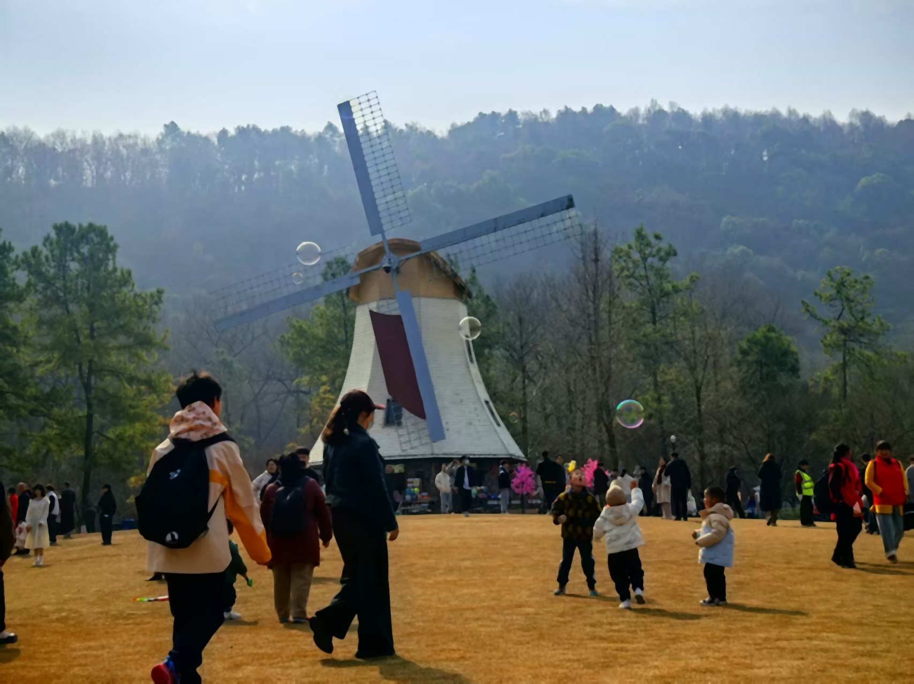
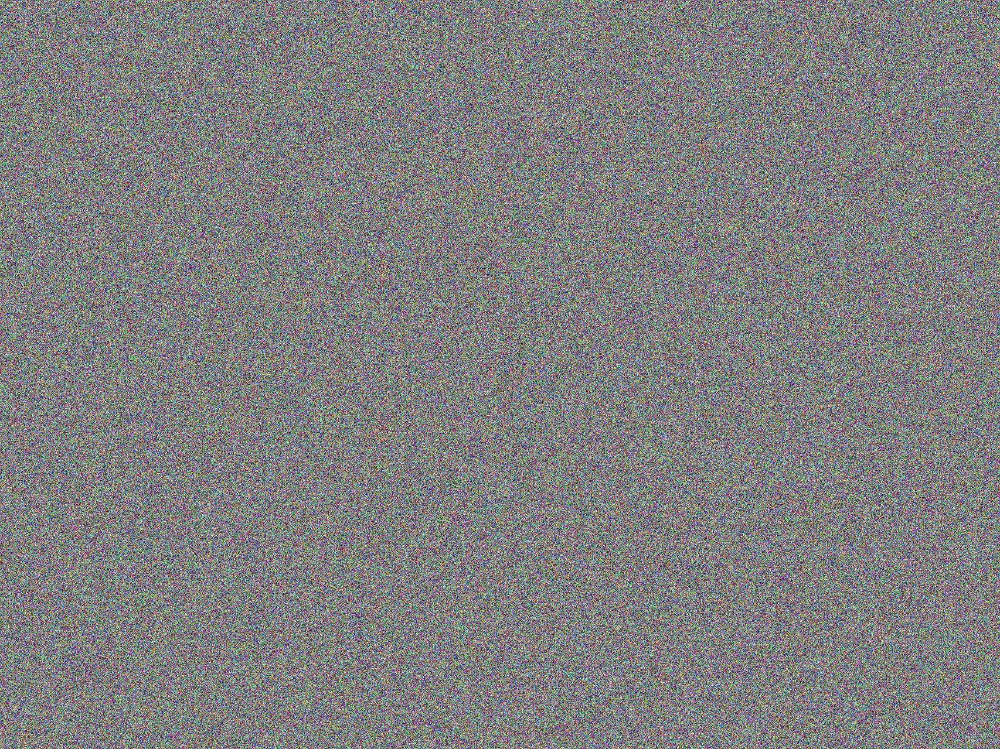
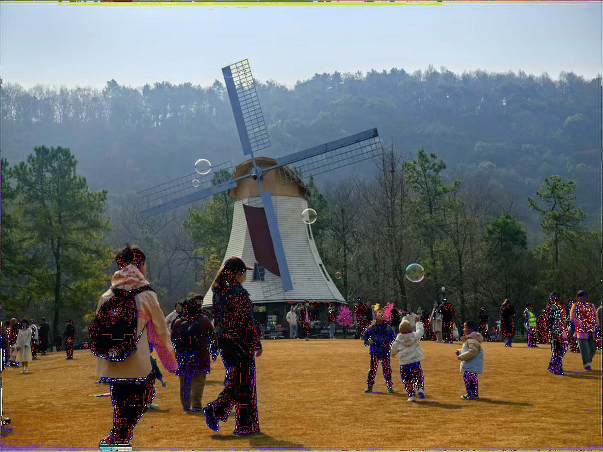
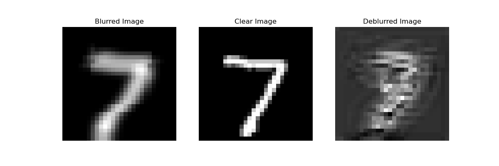

# Computational Imaging Course Assignment: Image Processing with Noise Addition and Denoising  

**Name**: Chen Jiashuo  
**Student ID**: 20241203368  
**Course**: Computational Imaging  

## Abstract  
This report focuses on the study of noise addition and denoising techniques in image processing. It first analyzes the principles and effects of four noise addition methods, then explores the performance of known kernel deconvolution, Unet, diffusion models, and Wiener filtering on test_RGB (color images) and test_MNIST (grayscale images). Finally, it summarizes the limitations of these methods, providing references for future research.  

## 1. Analysis of Image Noise Addition Methods  

### 1. Average Blur Noise  
- **Principle**: Convolution with a uniform kernel (e.g., 5×5 kernel) to average pixel values and reduce image details.  
- **Effect**: The image becomes uniformly blurred, losing details. In test_RGB, `test_RGB/average_blur.jpg` shows the effect of average blur, suitable for simulating simple uniform blur scenarios.  
{ width=300 }

### 2. Gaussian Blur Noise  
- **Principle**: Convolution with a Gaussian kernel (specified kernel size and standard deviation) to simulate natural blur like camera shake.  
- **Effect**: The image appears softly blurred. `test_RGB/gaussian_blur.jpg` shows the typical effect of Gaussian blur, widely used to simulate real-world blur scenarios.  
{ width=300 }

### 3. Motion Blur Noise  
- **Principle**: Convolution with a linear motion kernel (e.g., elongated kernel) to simulate blur caused by object movement.  
- **Effect**: The image shows streaks of blur. `test_RGB/motion_blur.jpg` simulates dynamic blur scenarios, such as blur from moving objects.  
{ width=300 }

### 4. Median Blur Noise  
- **Principle**: Median filtering kernel replaces pixel values with the median of the neighborhood, mainly targeting salt-and-pepper noise.  
- **Effect**: The image shows localized pixel replacement, creating a grainy blur effect. `test_RGB/median_blur.jpg` demonstrates its effect on simulating discrete noise.  
{ width=300 }

## 2. Analysis of Image Denoising Methods  

### 1. Known Kernel Deconvolution (including Wiener Filtering)  
- **RGB Images**: For test_RGB color images, channel-wise processing yields good results. For example, `test_RGB/gaussian_blur_restored_gaussian_known.jpg` (known Gaussian kernel deconvolution) and `test_RGB/gaussian_blur_restored_wiener.jpg` (Wiener filtering) require known noise kernel parameters (e.g., Gaussian kernel size, standard deviation) to restore color and details using prior information.  
{ width=300 }
{ width=300 }

- **MNIST Grayscale Images**: In test_MNIST, due to the single-channel information of grayscale images, they are sensitive to noise, and traditional deconvolution methods do not perform well. Deep learning methods need to be combined for further improvement. Due to the small size of MNIST dataset images, kernel size adjustment is required for deblurring, so even deep learning methods do not perform well. The following image shows the comparison of denoising effects on the MNIST dataset.  
{ width=300 }

### 2. Unet Method  
- **Principle**: Based on the Unet network in deep learning, it learns the mapping from noisy to clear images through an encoder-decoder structure.  
- **Effect**: It has strong capabilities for handling complex noise (e.g., mixed noise) but requires a large amount of training data. If well-trained, it can effectively restore image details, but it is highly dependent on training data.  

### 3. Diffusion Model  
- **Principle**: Adds noise through a forward diffusion process and learns to restore the image through a reverse denoising process.  
- **Effect**: As a generative denoising method, it has strong capabilities for restoring image structures and can handle various types of noise, but it consumes significant computational resources and has a slow inference speed.  

### 4. Wiener Filtering  
- **Principle**: In the frequency domain, it combines the signal-to-noise ratio (SNR) parameter to suppress noise while preserving the signal.  
- **Effect**: For noisy RGB images, adjusting the SNR parameter can balance noise suppression and detail preservation. It has better noise resistance than basic deconvolution but relies on prior noise estimation.  

## 3. Method Limitations  

### 1. Dependence on Prior Information  
Known kernel deconvolution and Wiener filtering methods heavily rely on noise kernel parameters and noise characteristics. If the prior information is inaccurate, the restoration effect will significantly decrease.  

### 2. Limitations in Grayscale Image Processing  
Grayscale images like MNIST lack color channel information, making traditional deconvolution methods susceptible to noise interference and insufficient in restoration accuracy. Deep learning methods (e.g., Unet) need to be combined to improve the effect.  

### 3. Computational and Resource Constraints  
Deep learning methods like diffusion models and Unet require high computational resources (e.g., GPUs) and long training times. Traditional methods (e.g., frequency domain processing) have limited capabilities for handling complex noise, making it difficult to balance efficiency and effectiveness.  

### 4. Generalization Challenges  
Different denoising methods are limited in their applicable scenarios and lack a unified framework to handle all types of noise. In practical applications, methods need to be selected or combined based on noise characteristics, utilizing multi-perspective information for complementarity or training a model to provide prior information.

## 4. Conclusion  
By analyzing noise addition and denoising methods, the effects and limitations of each method on test_RGB and test_MNIST are clarified. Future research can explore combining prior knowledge with deep learning methods to enhance the generality and effectiveness of denoising while reducing dependence on computational resources.